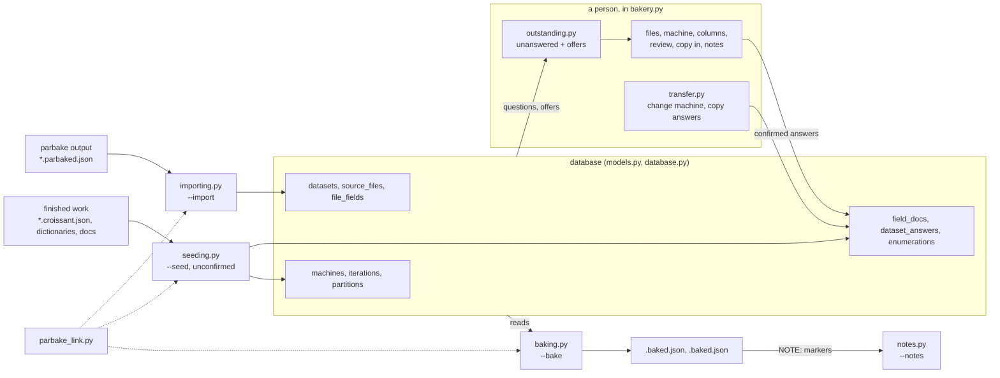

Here is the architecture of bakery, a Python tool. Use it as context.

bakery finishes par-baked Croissant metadata files written by parbake. It reads
them into a database, asks a person the questions a machine cannot answer (which
machine the data came from; what each column means, its type, unit and any note;
licence, citation and responsible-AI answers), and writes finished Croissants.
Answers are stored per (dataset, column), where a dataset is MACHINE_KIND, and an
answer given once is offered wherever the same column appears again.

Run: python3 bakery.py [--import DIR] [--seed PATH...] [--database URL]
     python3 bakery.py --bake --out DIR
     python3 bakery.py --notes PATH...

Rules:
- An import suggests a machine and assigns none.
- Seeded answers (from finished Croissants, field dictionaries, documentation)
  are unconfirmed and offered as defaults; placeholder descriptions are skipped.
- Offers from other datasets are shown, never applied on their own.
- Copying answers between datasets takes only confirmed source answers, fills
  gaps, and asks about each differing confirmed answer.
- Changing a file's machine carries its answers to the new dataset.
- Every answer is saved as it is given. Import and seed can be re-run.
- Output: a Croissant per file (with sha256) and per dataset (cr:FileSet).
  The par-baked marker is removed only when nothing is outstanding; finished
  files pass mlcroissant, unfinished ones fail.
- One process; SQLite by default, MySQL or PostgreSQL by URL. Schema
  migrations are forward-only.

Modules:
  bakery.py          the Textual interface and command line
  models.py          12 tables: machines, iterations, partitions, datasets,
                     source files, file fields, field docs, dataset answers,
                     enumerations and values, derived files, schema version
  database.py        opens the database; migrates older schemas
  importing.py       reads parbake output: files, columns, measurements
  seeding.py         reads finished work in, unconfirmed
  outstanding.py     what is unanswered; what other datasets can offer
  transfer.py        change a file's machine; copy answers between datasets
  baking.py          writes finished Croissants
  notes.py           finds NOTE: markers across Croissant files
  questions.py       the dataset-level question catalogue
  parbake_link.py    the only link to parbake
  bake_croissants.py older file-in, file-out path

